# Email System Data Flow

This document illustrates the refactored email system architecture and data flow.

## Architecture Overview

The refactored system splits the previously monolithic emailController.js and mailWriter.js into smaller, more focused modules with clear responsibilities:

1. **Email Controllers**: Handle HTTP requests, validation, and responses
2. **AI Services**: Generate email content with AI
3. **Email Services**: Send emails via Resend API
4. **Database Services**: Log email activities and results

## Data Flow Diagram

## Key Components

### Controllers

- **Bulk Email Controller**: Handles sending the same email to multiple recipients
- **Individual Email Controller**: Handles sending unique emails to different recipients
- **AI Email Controller**: Handles generating and sending AI-powered emails
- **Utility Controller**: Handles utility operations like Excel conversion

### Services

- **Email Generator**: Core logic for generating email content with AI
- **Prompt Builder**: Constructs prompts for the AI model
- **Response Parser**: Parses AI responses into structured email content
- **Template Engine**: Handles variable replacement in templates

### Shared Utilities

- **Validators**: Input validation for all controllers
- **Response Formatter**: Standardized API response formatting

## Data Structure Simplifications

1. **Consistent Validation**: Standard validation patterns across all controllers
2. **Simplified Response Format**: Consistent success/error response structure
3. **Cleaner Data Flow**: Clear data transformation between components
4. **Standardized Error Handling**: Centralized error handling and logging

This refactored architecture improves maintainability, testability, and separation of concerns while reducing unnecessary complexity in the data structures and processing logic. 

